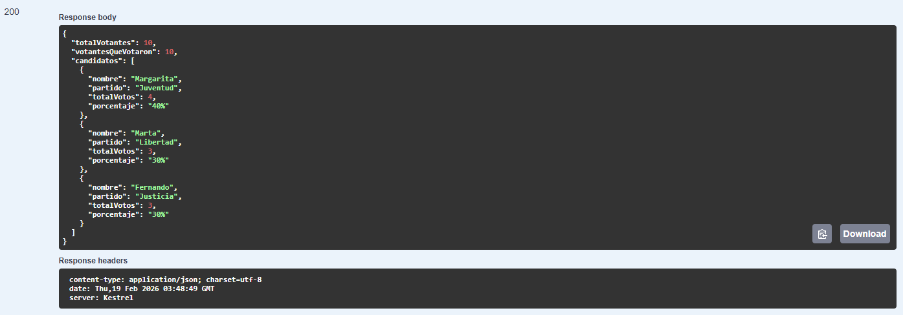

# Sistema de Votaciones - API RESTful

Este proyecto es una API para gestionar un sistema de votaciones. Permite registrar votantes y candidatos, emitir votos, y obtener estadísticas de la votación.

---

## Tecnologías usadas

- .NET 8 / ASP.NET Core
- Entity Framework Core
- SQL Server
- JWT para autenticación
- Swagger para pruebas de API

---

## Modelos

### Votante
- `Id` (int, autogenerado)
- `Nombre` (string, obligatorio)
- `Email` (string, único, obligatorio)
- `SiVoto` (bool, por defecto `false`)

### Candidato
- `Id` (int, autogenerado)
- `Nombre` (string, obligatorio)
- `Partido` (string, opcional)
- `Votos` (int, por defecto 0)

### Voto
- `Id` (int, autogenerado)
- `VotanteId` (int)
- `CandidatoId` (int)

---

## Endpoints principales

### Votantes
- `GET /api/votantes` → Listar votantes (con filtros y paginación)
- `POST /api/votantes` → Registrar votante
- `GET /api/votantes/{id}` → Obtener votante por ID
- `DELETE /api/votantes/{id}` → Eliminar votante

### Candidatos
- `GET /api/candidatos` → Listar candidatos
- `POST /api/candidatos` → Registrar candidato
- `GET /api/candidatos/{id}` → Obtener candidato por ID
- `DELETE /api/candidatos/{id}` → Eliminar candidato

### Votos
- `POST /api/votos` → Emitir voto (solo enviar `votanteId` y `candidatoId`)
- `GET /api/votos` → Listar votos emitidos
- `GET /api/votos/estadisticas` → Obtener estadísticas:
  - Total de votos por candidato
  - Porcentaje de votos por candidato
  - Total de votantes que han votado

---

## Autenticación

- JWT Bearer
- Antes de usar los endpoints protegidos, obtener token desde `POST /api/auth/login`
- Incluir en Swagger el token con el prefijo `Bearer `
- Para usar los Endpoints protegidos, primero obten un token con:
```json
POSTT api/Auth/Login
{
  "usuario": "admin",
  "password": "1234"
}
```
-Luego incluye el token con el prefijo `Bearer `, ejemplo:
```nginx
Bearer eyJhbGciOiJIUzI1NiIsInR5cCI6IkpXVCJ9...
```
---

## Cómo ejecutar localmente

1. Clonar el repositorio:

```bash
git clone https://github.com/cardonacristian/Sistema-de-votaciones.git
```

2. Abrir la solcuión en Visual Studio.
3. Configurar la cadena de conexión en `appsettings.json`
4. Ejecutar migraciones, en la parte `Herramientas -> NuGet Package Manager -> Package Manager Console`
```bash
Update-Database
```
5. Ejecutar el proyecto `F5` o `Ctrl + F5`
6. Abrir Swagger en https://localhost:{puerto]/swagger

---

## Ejemplo de uso en Swagger
### Registrar votante
```json
POST /api/votantes
{
  "nombre": "Hector Gómez",
  "email": "hector.gomez@example.com"
}
```
### Emitir voto
```json
POST /api/votos
{
  "votanteId": 1,
  "candidatoId": 2
}
```
## Estadistica

